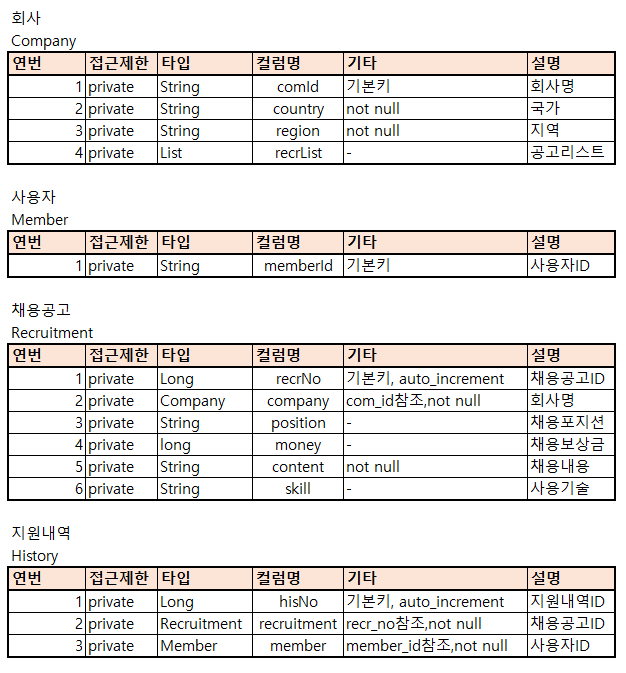
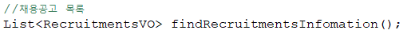

# 프리온보딩 백엔드 인턴십 선발과제
## README 에 요구사항 분석 및 구현 과정을 작성
## 요구사항 분석

## 구현과정
1. 전체적인 흐름을 보고 필요한 Entity부터 설계
2. Entity 설계 후 Repository -> Service -> ServiceImpl -> Contorller 순으로 추가 및 커밋
3. 채용공고 등록 작성

    #### RecruitmentService
    

    #### RecruitmentServiceImpl
    

    #### ApiController
    

    ### 등록 성공시
    
    

        양식
        {
        "company":{"comId" : "회사이름" },
        "position" : "포지션",
        "money" : 보상금,
        "contnt" : "내용",
        "skill" :"스킬"
        }

    ### 등록 실패시
        

4. 채용공고수정 작성
    #### RecruitmentService
    

    #### RecruitmentServiceImpl
    

    #### ApiController
    

    ### 수정 성공시
    
    

    ### 수정 실패시
        

5. 채용공고 삭제
    #### RecruitmentService
    

    #### RecruitmentServiceImpl
    

    #### ApiController
    

    ### 삭제 성공시
    
    

    ### 삭제 실패시
        

6. 채용공고목록
    #### RecruitmentRepository
    

    #### RecruitmentService
    

    #### RecruitmentServiceImpl
    

    #### ApiController
    

    ### 목록조회
    

7. 채용공고 검색 기능구현
    #### RecruitmentsVO
    

    #### RecruitmentRepository
    

    #### RecruitmentService
    

    #### RecruitmentServiceImpl
    

    #### ApiController
    

    ### 검색조회
    

8. 채용 상세 페이지 + 다른채용공고
    #### RecruitmentDetailVO - 상세
    

    #### RecruitmentDetailListVO - 리스트추가
    

    #### RecruitmentRepository
    

    #### RecruitmentService
    

    #### RecruitmentServiceImpl
    

    #### ApiController
    

    #### 조회 테스트 전 DB
    

    #### 상세조회
    

9. 사용자는 채용공고에 지원합니다
    #### HistoryRepository
    

    #### RecruitmentService
    

    #### RecruitmentServiceImpl
    

    #### ApiController
    

    #### HistoryDTO
    

    #### 지원
    

    #### 이미 지원한 공고 일 경우
    